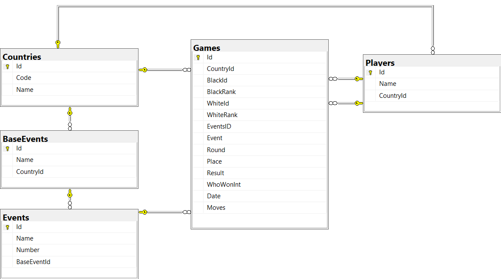

# BGO-Tournament

This is a side project based on my original BGO project.

BGO-Tournament will be a set of tools and a React app to study professional games from Go tournaments around the world.

## Goals
* Harvest game records from web
* Find tournament games and import into SQL database
* Use React page to browse tournaments, players, and games using original BGO SVGBoard


## Tournament name formats
```
Ordinal   Country    Base Event Name
    1st   Japanese   Meijin
    22nd  Chinese    Mingren
    5th              Asian TV Cup
```
In the database:
* Event: '1st Japanese Meijin'
* BaseEvent: 'Japanese Meijin'
* Country: 'Japan'


## Diagram: SQL Tables



# Components

## Game file harvester

Downloads all SGF files from GoKifu.Com site and stores in "Output" directory.

To process files with the script generator, compress them into a TGZ.

## SQL script generator

Extracts tournament games from TGZ, parses event tags, and creates SQL script needed to create and fill database with data.

__output.sql__ is output of script.

Create __BGO__ database on target SQL server, run script to setup, create a user to connect to database.

## Flask server

Use __.env.sample__ to create your __.env__ file, then run the flask server.

Routes:
```
/Tournaments/
/Countries/<int:country_id>
/BaseEvents/<int:base_event_id>
/Events/<int:event_id>
/Players/<int:player_id>
/Games/<int:game_id>
```

Return values are
```
[
    [ColumnName, ColumnName, ...],
    [Data, Data, ...]
    [Data, Data, ...]
]
```


# Update History

## [1] Initial Work
* Created game harvester 
* Created SQL script generator
* Created basic flask server to access data
* 26k tournament games found and imported into database
* Tested flask server with Insomnia
* Basic views setup on server


# License
This program is free software: you can redistribute it and/or modify it under the terms of the GNU General Public License as published by the Free Software Foundation, either version 3 of the License, or (at your option) any later version.

This program is distributed in the hope that it will be useful, but WITHOUT ANY WARRANTY; without even the implied warranty of MERCHANTABILITY or FITNESS FOR A PARTICULAR PURPOSE. See the GNU General Public License for more details.

You should have received a copy of the GNU General Public License along with this program. If not, see https://www.gnu.org/licenses/.